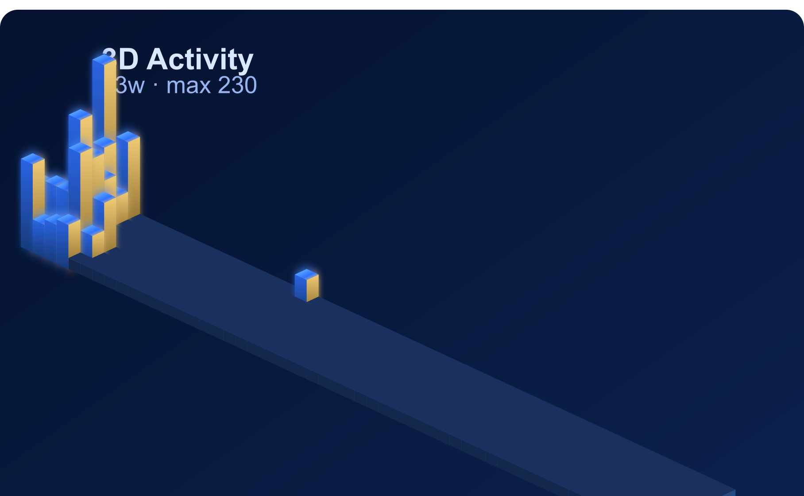

# William Kang (Ching-Wei Kang)

**CS + Data Science @ UW-Madison (2027)** · Building robust systems, AI/ML, seamless UX

  
  
  
  
  
  
  

---

<table>
  <tr>
    <td width="62%" valign="top">
      
    </td>
    <td width="38%" valign="top">

### 🛠️ Stack
- **AI/ML:** Python · PyTorch · OpenAI
- **Backend:** Node.js · Go · PostgreSQL
- **Frontend:** React · Next.js · TypeScript
- **Infra:** Docker · AWS · GitHub Actions

### 🚀 Featured Projects
- [D&D Voice Adventure](https://dungeons-and-dragons-adventure-voic.vercel.app) — AI voice D&D (Next.js · OpenAI · Web Speech)
- [prompttrace](https://github.com/WilliamK112/prompttrace) — LLM tracing/debugging (TypeScript · Python)
- [TrustRent](https://madhacks2025-trustrent.vercel.app) — Tenant trust scoring (Next.js · PostgreSQL)
- [ClawWork-personal](https://github.com/WilliamK112/ClawWork-personal) — AI workflow automation (OpenAI · Node.js)
- [llm-fit](https://github.com/WilliamK112/llm-fit) — Local LLM benchmarking (Python · Ollama)

    </td>
  </tr>
</table>

---

⚡ Always building. Always shipping.
