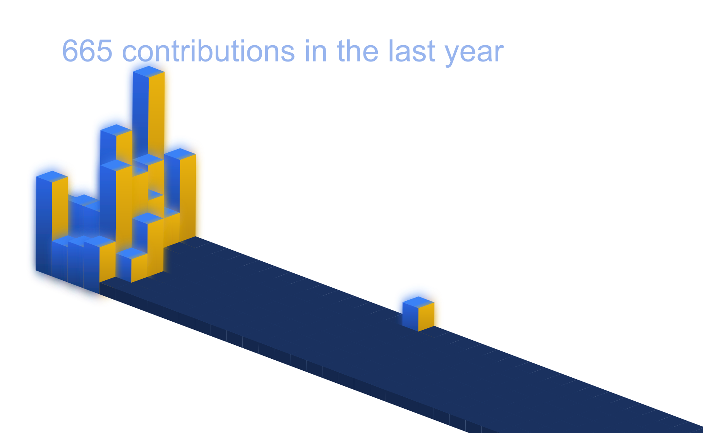

# William Kang (Ching-Wei Kang)

**CS + Data Science @ UW-Madison (2027)** · Building robust systems, AI/ML, seamless UX

  
  
  

**👋 About Me**  
CS + Data Science student @ UW-Madison (Class of May 2027)  
Focus: AI systems, developer tools, and product engineering  
Now building: OpenClaw workflows, LLM tooling, and practical automation  
Contact: [ckang53@wisc.edu](mailto:ckang53@wisc.edu)  

**Stack**  
 Python · PyTorch · OpenAI  
 Node.js · Go · PostgreSQL  
 React · Next.js · TypeScript  
 Docker · AWS · GitHub Actions

 

---

⚡ Always building. Always shipping.

